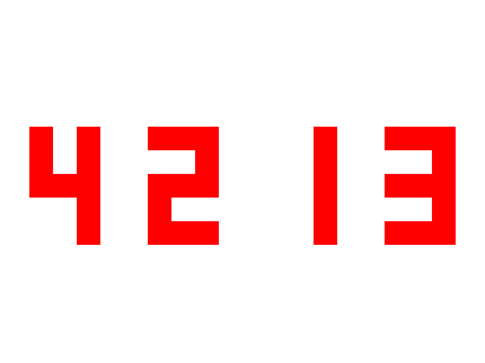

# BMP Creater

## Contents

- [main.c](main.c): Draw picture for numbers
- [draw.c](draw.c): BMPHeader initialize
- [setdigits.c](setdigits.c): Set digits for bmp

## Usage

```sh
make
./createbmp
```

## Expected InPut

``` sh
Input your number!(It should be a positive natral number and less than 10000)!
4213
```

## Expected OutPut

test.bmp


