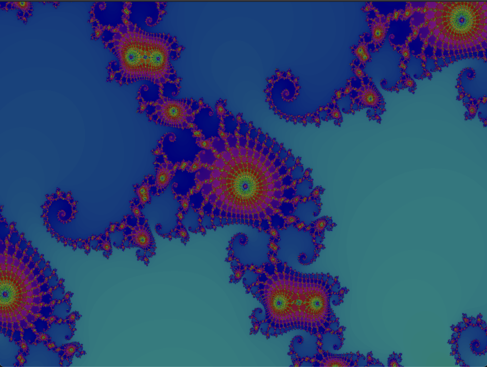

# 绘制 Mandelbrot 集的程序

- [mandelbrot.c](mandelbrot.c): mandelbrot图像绘制



## 编译要求

调用了 math-soft/bmp/draw.c 中的函数用于产生 BMP文件.
配备了Makefile文件，可以直接如下编译并得到mandelbrot的可执行文件，具体编译依赖见Makefile文件.

```shell
make mandelbrot
```

## 运行

主函数一共 6 个参数, 分别是: 绘制区域的中心坐标 (Ox, Oy), 宽度, 高度, 最大迭代次数, 绘制方格的边长.

典型的运行是:

```shell
./mandelbrot -1.453862 0.0030 1024 1024 70 0.000001
./mandelbrot -1.0 0.0 1024 1024 30 2.0
```

## 可视化尝试1

需要自行安装SDL库.

- [sdlclick.c](sdlclick.c): 运用SDL库，实现通过鼠标点击不断放大图像，渲染细节. 问题是计算速度较慢.

编译使用

```shell
make sdlclick
```

运行使用

```shell
./sdlclick
```

## 可视化尝试2

- [sdldyn.c](sdldyn.c): 运用SDL库，实现以固定缩放点自动缩放动态渲染mandelbrot集.

主函数一共2个参数，分别是: 固定缩放点的坐标(Ox, Oy)

一些有意思的固定放缩点: (-0.16, 1.0405); (-1.768573656315270993824967885123, 0.0010862864094357362103545925752378); (-0.743643887037158704752191506114774, 0.131825904205311970493132056385139);

编译使用

```shell
make sdldyn
```

运行使用

```shell
./sdldyn -0.746 0.1 
```
